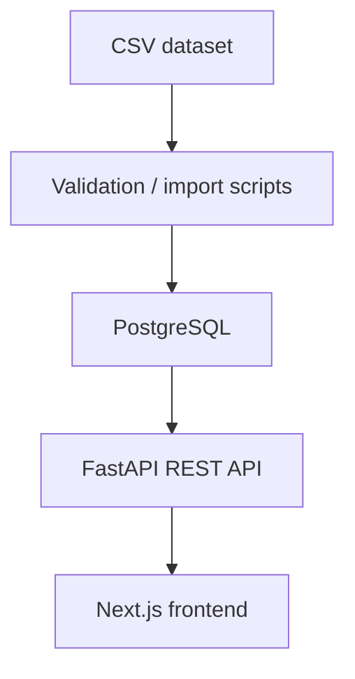

# F1 Analytics

F1 Analytics is a full-stack Formula 1 dashboard built from historical data
covering the 1950–2024 seasons. It combines an interactive Next.js frontend,
a FastAPI REST API, and PostgreSQL-backed race, driver, constructor, standings,
and analytics data.

## Live Demo

- **Frontend:** https://f1-analytics-nine.vercel.app
- **Backend API:** https://f1-analytics-api-0xcc.onrender.com
- **API Docs:** https://f1-analytics-api-0xcc.onrender.com/docs

## Features

- Dashboard overview and historical statistics
- Driver and constructor career statistics
- Historical championship standings and progression
- Race Explorer with results, qualifying, pit stops, and lap times
- Cross-season driver and constructor analytics
- Search across drivers, constructors, races, and standings
- Clerk authentication

## Tech Stack

| Area | Technologies |
| --- | --- |
| Frontend | Next.js, React, TypeScript, Recharts, Tailwind CSS |
| Backend | FastAPI, Python |
| Data layer | PostgreSQL, SQLAlchemy, Pydantic |
| Migrations | Alembic |
| Authentication | Clerk |
| Data processing | pandas, Python CSV validation/import scripts |

## Architecture



CSV validation and import scripts provision PostgreSQL. The versioned FastAPI
service exposes the data consumed by the Next.js frontend.

## Key Engineering Highlights

- Versioned FastAPI REST API under `/api/v1` with OpenAPI documentation
- Relational PostgreSQL data model for historical F1 entities and results
- Alembic-managed database migrations
- Validated CSV import pipeline for bulk data loading
- Interactive Recharts analytics visualizations
- Automated backend tests and frontend TypeScript, Jest, and production-build checks
- Production deployment using Vercel, Render, and PostgreSQL

## Data

The historical dataset covers Formula 1 seasons from 1950 through 2024 and is
stored in PostgreSQL.

## Testing

**Backend**

```bash
cd backend
source .venv/bin/activate
python -m pytest
```

**Frontend**

```bash
cd frontend
npx tsc --noEmit
npm test -- --runInBand
npm run build
```

## Deployment

- **Frontend:** Vercel
- **Backend:** Render
- **Database:** PostgreSQL
