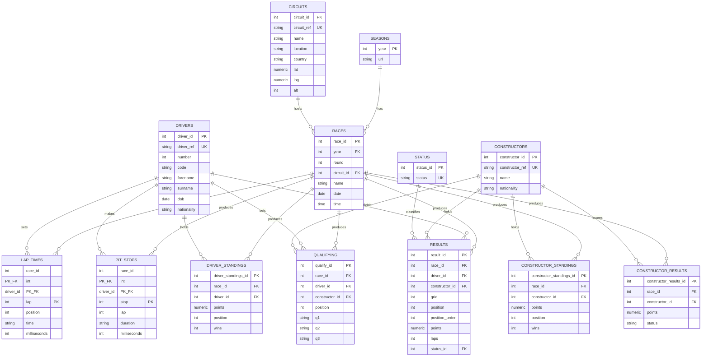

# Entity-Relationship Diagram

Rendered automatically by GitHub/GitLab (Mermaid support) or any Mermaid
live editor. Cardinality: `||--o{` reads as "one (mandatory) to many (optional)".

## Relationship summary

| Relationship | Cardinality | Notes |
|---|---|---|
| Season → Race | 1:N | A season has many races; a race belongs to exactly one season (via `year`). |
| Circuit → Race | 1:N | A circuit hosts many races over the years; a race is held at exactly one circuit. |
| Race → Result / LapTime / PitStop / Qualifying / DriverStanding / ConstructorStanding / ConstructorResult | 1:N | Every per-race detail table hangs off `race_id`. |
| Driver → Result / LapTime / PitStop / Qualifying / DriverStanding | 1:N | A driver appears in many races over a career. |
| Constructor → Result / Qualifying / ConstructorStanding / ConstructorResult | 1:N | A constructor fields cars across many races. |
| Status → Result | 1:N | A finish status (e.g. "Finished", "Engine", "Accident") applies to many results. |

## Design notes

- **`LapTime` and `PitStop` use composite primary keys** (`race_id, driver_id, lap` / `race_id, driver_id, stop`) rather than surrogate IDs — see `database/INDEX_STRATEGY.md` for the reasoning.
- **`DriverStanding`/`ConstructorStanding` store cumulative season points** as of each race, not just that race's points — this is what the source dataset provides and what the championship-progression chart needs directly, with no running-sum calculation required at query time.
- **`ConstructorResult`** is distinct from `ConstructorStanding`: it holds the points scored in a *single* race, whereas `ConstructorStanding` holds the cumulative total after that race.
